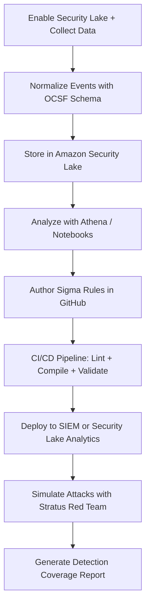

# 🤠 Open Security Data Lake + Detections-as-Code  
**Operationalizing OCSF + Sigma + Attack Simulation in AWS**  

[](https://aws.amazon.com/security-lake/)  [](https://schema.ocsf.io/)  [](https://github.com/features/actions)  [](https://stratus-red-team.cloud/)  [](LICENSE)  

---  

## 📘 Overview  
This project operationalizes **AWS Security Lake**, **OCSF normalization**, **Sigma detections**, and **Stratus Red Team** attack simulation inside a single GitHub-driven pipeline.

You’ll stand up a real AWS Security Data Lake, author and test detections-as-code, simulate attacks, and produce measurable detection coverage.  

---  

## ⚡️ Quickstart  
```bash  
git clone https://github.com/xaviermotley/open-security-datalake-dac.git  
cd open-security-datalake-dac  
bash datalake/enable-security-lake.sh  
python3 datalake/normalize-ocsf.py  
bash detections/ci/compile-to-splunk.sh  
bash simulations/tests/validate-detections.sh  
python3 detections/ci/detection-report.py  
```  
✅ Outputs  
- `detections-report.md` — detection coverage summary  
- `datalake/notebooks/analyze-events.ipynb` — explore OCSF data  
- GitHub Actions — automated validation and reports  

  
  

---  

## 📝 Architecture  


---  

## 📂 Key Files  
| Path | Description |  
|------|--------------|  
| `datalake/enable-security-lake.sh` | Enables Security Lake and sources |  
| `datalake/normalize-ocsf.py` | Converts CloudTrail logs into OCSF schema |  
| `detections/sigma/*.yml` | Sigma detection rules |  
| `simulations/tests/validate-detections.sh` | Runs Stratus simulations |  
| `.github/workflows/detections-ci.yml` | CI/CD automation workflow |  

---  

## 📈 Example Report  
| Rule | Scenario | Status | Coverage | Last Run |  
|------|-----------|---------|-----------|-----------|  
| s3-public-access.yml | aws.s3.bucket-enumeration | ✅ | 100% | 2025-11-09 |  
| iam-passrole-abuse.yml | aws.iam.passrole.misuse | ⚠️ | 80% | 2025-11-09 |  

---  

## 📑 References  
- [Operationalizing Amazon Security Lake](https://aws.amazon.com/security-lake/)  
- [SigmaHQ Rules](https://github.com/SigmaHQ/sigma)  
- [Stratus Red Team](https://stratus-red-team.cloud)  
- [OCSF Schema](https://schema.ocsf.io)  
- [MITRE ATT&CK](https://attack.mitre.org)  

---  

## 💄 License  
MIT License © 2025 [Xavier Motley](https://linkedin.com/in/xaviermotley) 
